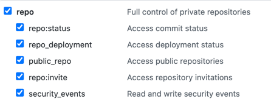

# Github Runner Bootstrap
This directory holds a single Cloudformation template to set up the following
* A Single VPC, NAT Gateway, IG, Private/Public Subnet, VPC Endpoints to ensure private networking
* GithubRunner attached to your specified Github repository 
* Terraform Remote State S3 Bucket and DynamoDB
* S3 bucket containing the exercise's data to be ingested and transformed

## Setup
1. Clone this repository
2. [Create a Github Personal Access Token](https://docs.github.com/en/github/authenticating-to-github/creating-a-personal-access-token) with the Repo Scope. This will be used to generate a token to register a GithubRunner.

3. Set up your AWS CLI and authenticate to your AWS account and store those credentials in a profile called `data-derp` NOTE: to reduce clashing with other AWS credentials, the bootstrap script uses an AWS_PROFILE called `data-derp`.
4. OPTIONAL: Switch your role.  For those expected to assume a role (within the same account), there is a helper function:
```bash
./switch-role -b <starting-role> -t <target-role>
```
5. Create the Stack. 
```bash
./aws-deps -p your-project-name -m your-team-name -u your-github-username
```
:bulb: the `your-project-name` and `your-team-name` must be globally unique as an AWS S3 bucket is created (this resource is globally unique)

6. When prompted, enter your Personal Access Token (created in step 1)
```bash
Enter host password for user 'your-github-username': <the-personal-access-token>
```

7. View your [Cloudformation Stacks in the AWS Console](https://eu-central-1.console.aws.amazon.com/cloudformation/home?region=eu-central-1#/stacks)
